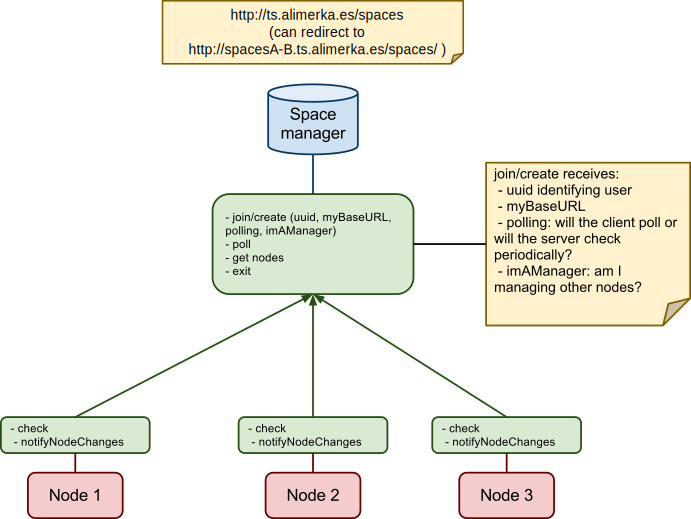
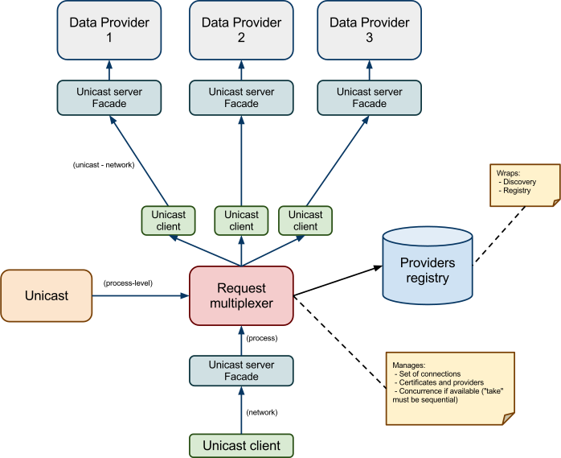

.. Otsopack multicast coordination
   HTTP version - First draft 

.. contents::

Discovery
*********

Otsopack manages the discovery of nodes in the space, in a seamless way for the developer.
In order to do so, Otsopack defines a set of components that will be deployed in different ways depending on the scenario.

Scope
=====

In Otsopack there are different primitives to retrieve and modify triples:

 * read
 * take
 * query
 * write

They all work in a *space*: "read a graph which matches this template in space A", "query on all the graphs of the space B". 

The discovery process manages two things:
 * **Discovering** which nodes are in these spaces
 * **Maintaining** which nodes are alive at this moment

When programming with Otsopack, developers are not aware of this information.
But it is important that this information is updated.
If the node where it is being executed has not discovered that another node exists in the same space, it will not retrieve information from it.
If the node does not know that this node has disappeared, it will take longer since it will wait for some information that will never arrive.

Hierarchy
=========

Otsopack supports a wide range of devices: very small devices (sensors), rich mobile phones (Android), regular computers and servers.
The scenarios covered where otsopack is used cover very different topologies, where very few devices are used -even 2!- without infrastructure to big deployments with hundreds of potential devices.

Therefore, the design of the discovery system must be hierarchical, so smaller nodes can rely on bigger nodes to find the information.

Node
----

There are **nodes**. Every node implements the primitives.
 * It must have a UUID (which can be temporal, since it is only used in discovery)
 * It can be checkable (if the space manager can directly call a "check" method to check that it is in fact available) 
 * It can poll a space manager (if it will call every few seconds the space manager to ensure that it still exists)
 * It can be permanent (not checkable and it does not poll, but is always there). This makes sense if the space manager is the same node as the node itself.

Space Manager
-------------

There are *Space Managers*. They maintain a list of alive nodes **per space**.
 * A Node can join to one or more Space Managers. Since they all provide a UUID, a node should not call more than once to the same node.
 * A Space Manager will maintain the list, knowing which nodes are available and which nodes are down, thanks to the check/poll mechanisms.

|

Discovery
---------

There are **Discovery** components. They find Space Managers in the environment.
 * When requested, it returns the Space Manager it can find (in a file, in memory, in a HTTP server, through multicast **(not implemented)**)
 * It is assumed that these space managers are already handling the nodes they support.

The main difference between Space Managers and Discovery components is that the Space Manager maintains a list of final nodes, while the Discovery component searches in every call for the Space Managers.
This can be clarified in the following section.

Sample scenarios
================

Many devices, infrastructure provided
-------------------------------------

Consider a mobile phone entering in a pub where there are other 50 users with their mobile phones connected.
If all the phones tried to maintain the list of available phones through polling, every phone would perform requests to the rest and therefore every phone would need to process 50 requests every few seconds.
In order to delegate the maintaining of the list, the pub could provide some kind of infrastructure (such as a desktop machine connected to the network) that would act as a *Space Manager*.
It would check every few seconds if the mobile phones are still there (or it would expect them to perform a request every few seconds).
Any mobile phone would also perform a call every few seconds to get the latest version of the list of alive mobile phones.
The amount of requests performed or processed by each mobile phone is far smaller.
When the user enters in the pub, the Discovery will check what Space Managers are available, and it will call them, automatically retrieving the full list of devices.

Few devices, infrastructure not provided
----------------------------------------

Consider a small set of sensors in a room.
They all could have their own Space Manager, pointing only to the current node.
Whenever a new sensor appears in the room, the Discovery components will find the Space Manager of the device, and therefore they will find the node it manages.

Future possible scenarios
-------------------------

A dynamic system could be implemented if there are many devices and no infrastructure is provided.
The first node could start a Space Manager that the rest would use.
When the number of nodes managed by the Space Manager is increased (for instance, 5 in a mobile phone), the Space Manager could start rejecting nodes trying to be added, so a rejected node could start serving as alternative Space Manager.
It would take few seconds to check that there is a new space manager to ask for maintained nodes.
Also, whenever a node with a Space Manager becomes outreachable, the managed nodes will notice because they are not checked anymore or because they have problems when polling.
They could find other Space Manager to be maintained again in the space.

Development
===========

Node
----

 * `Node <https://github.com/gomezgoiri/otsopack/blob/master/otsoCommons/src/otsopack/commons/network/coordination/Node.java>`_

Space Manager
-------------

 * `ISpaceManager <https://github.com/gomezgoiri/otsopack/blob/master/otsoCommons/src/otsopack/commons/network/coordination/ISpaceManager.java>`_
 * `Implementations <https://github.com/gomezgoiri/otsopack/blob/master/otsoCommons/src/otsopack/commons/network/coordination/spacemanager>`_

   * `Simple <https://github.com/gomezgoiri/otsopack/blob/master/otsoCommons/src/otsopack/commons/network/coordination/spacemanager/SimpleSpaceManager.java>`_ (stores it in memory)
   * `File <https://github.com/gomezgoiri/otsopack/blob/master/otsoCommons/src/otsopack/commons/network/coordination/spacemanager/FileSpaceManager.java>`_
   * `Http <https://github.com/gomezgoiri/otsopack/blob/master/otsoCommons/src/otsopack/commons/network/coordination/spacemanager/HttpSpaceManager.java>`_ (to an external `server <https://github.com/gomezgoiri/otsopack/blob/master/otsoCommons/src/otsopack/commons/network/coordination/spacemanager/http/server/>`_)
   * `Multiplexer <https://github.com/gomezgoiri/otsopack/blob/master/otsoCommons/src/otsopack/commons/network/coordination/spacemanager/MultiplexerSpaceManager.java>`_ (takes more than one Space Manager)

Discovery
---------

 * `IDiscovery <https://github.com/gomezgoiri/otsopack/blob/master/otsoCommons/src/otsopack/commons/network/coordination/IDiscovery.java>`_
 * `Implementations <https://github.com/gomezgoiri/otsopack/blob/master/otsoCommons/src/otsopack/commons/network/coordination/discovery>`_

   * Simple (stores it in memory)
   * Http (to an external server)
   * Multiplexer (takes more than one Space Manager)

Registry
--------

In order to avoid dealing with the Discovery directly, there is an interface called `IRegistry <https://github.com/gomezgoiri/otsopack/blob/master/otsoCommons/src/otsopack/commons/network/coordination/IRegistry.java>`_.
Its implementations can be found `here <https://github.com/gomezgoiri/otsopack/blob/master/otsoCommons/src/otsopack/commons/network/coordination/registry>`_.

|

