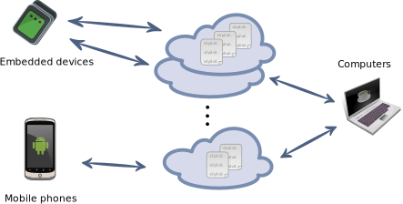

.. Otsopack documentation master file, created by
   sphinx-quickstart on Wed Oct 17 11:36:55 2012.
   You can adapt this file completely to your liking, but it should at least
   contain the root `toctree` directive.

Otsopack's documentation
========================

Otsopack is a Triple Space solution which has different incarnations for heterogeneous devices. Triple Space Computing (TS) is a paradigm based on Tuple Spaces where Semantic Web techniques are used to define the knowledge which is exchanged using a distributed shared space (for more information see `this presentation in Spanish <http://www.slideshare.net/twolf/presentacin-otsopack-a-tecnalia>`_).

Otsopack runs on...
###################
Otsopack is designed to be run in a wide variety of devices with limited computational resources. More specifically, nowadays those platforms are supported:
 * `OtsoSE Java SE <https://github.com/gomezgoiri/otsopack/tree/master/otsoSE>`_
 * `OtsoDroid Android <https://github.com/gomezgoiri/otsopack/tree/master/otsoDroid>`_
 * FoxG20 & XBee (Python)
 * Sunspots

Use cases
#########

In order to understand the scope of the project, the following use cases can be considered:

 * As part of the `ISMED project <http://www.tecnologico.deusto.es/projects/ismed/index_en.html>`_ (2008-2010), heterogeneous mobile devices interacted with others, using the JXTA peer-to-peer protocol

   * The considered scenarios were mainly domotic, as detailed `here <publications.html#ismed>`_.

 * As part of the `ACROSS project <http://www.acrosspse.com/>`_, rich mobile devices interact with each other and with the infrastructure

   * We have published two articles describing the supermarket scenario and the hospital scenario (check it `here <publications.html#across>`_).

 * As part of the `TALIS+ENGINE project <http://www.morelab.deusto.es/talisman>`_, embedded devices in Ambient Intelligent scenarios (check it `here <publications.html#talis-engine>`_).
 * As part of the `THOFU project <http://www.thofu.es>`_, mobile and embedded devices in Ambient Intelligent scenarios within a Hotel (check it `here <publications.html#thofu>`_).

Authors
#######

This solution has been developed by members of the `MORElab Research Group <http://www.morelab.deusto.es>`_ at `DeustoTech - Deusto Institute of Technology <http://www.deustotech.eu>`_ in the `University of Deusto <http://www.deusto.es>`_.

Check related publications `here <publications.html>`_.

Contents
========

.. toctree::
   :maxdepth: 1

   dependencies
   restservices
   discovery
   subscriptions
   acknowledgements
   publications

Indices and tables
==================

* :ref:`genindex`
* :ref:`modindex`
* :ref:`search`

