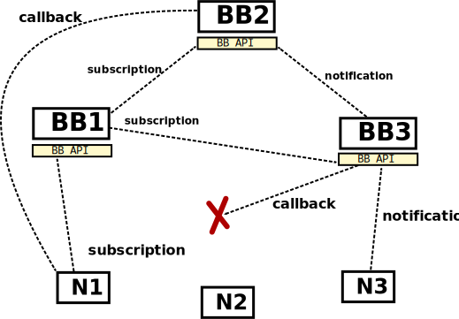

.. highlight:: java

Subscriptions
*************

This page describes in detail the subscription system of Otsopack.

.. contents::

Subscription primitives
=======================

The subscription primitives the developer should use are the following ones:
 * :ref:`subscribe <sec-subscribe>`
 * :ref:`unsubscribe <sec-unsubscribe>`
 * :ref:`notify <sec-notify>`

.. _sec-subscribe:
subscribe
---------

The node subscribes to the given template returning an URI which identifies the subscription.::

  public String subscribe(String spaceURI, NotificableTemplate template, INotificationListener listener) throws SpaceNotExistsException, SubscriptionException;

.. _sec-unsubscribe:
unsubscribe
-----------

Unsubscribes to a subscription given its subscription URI.::

  public void unsubscribe(String spaceURI, String subscriptionURI) throws SpaceNotExistsException, SubscriptionException;

.. _sec-notify:
notify
------

Notifies a template so the subscribed nodes will be warned.::

  public void notify(String spaceURI, NotificableTemplate template) throws SpaceNotExistsException,  SubscriptionException;

Deployment
==========

Bulletin boards
---------------

The nodes responsible of handling subscriptions and notifications are called *bulletin boards*. Other *Otsopack* nodes belonging to the same space, discover them through a *registry* and publish their subscriptions and notifications using their HTTP API.

Each *bulletin board*:

 * Belongs to a space.
 * Exposes a subscription API (see [Subscriptions#Subscription_HTTP_API below]).
 * Shares its subscriptions with other bulletin boards which belong to the same space.
 * Propagates the notifications to the relevant nodes using the *callback url* provided by them.

To manage the bulletin boards we use a ''IRemoteBulletinBoardsManager''. It can be created independently or in conjuntion with a TSC kernel.

To create it independently, we should do:::

  final IRemoteBulletinBoardsManager bbm = BulletinBoardsManager.createPlain(registry);
  bbm.startup();
  ...
  bbm.shutdown();

To get the ''IRemoteBulletinBoardsManager'' of an already created TSC kernel, we use::

  ((HttpKernel)kernel).getNetworkService().getBulletinBoardsManager();

Once we have the ''IRemoteBulletinBoardsManager'' object, if we want to create a bulletin board, we use:::

  bbm.createRemoteBulletinBoard(Description.spaceuri, PORT);

On the other hand, if we want to use a remote ''bulletin board'' in the kernel, it will be transparently created the first time a subscription primitive is used for a given space.

Practical example
-----------------

In the image shown below, we can see a graphic representation of the following example:

 #. *N1* subscribes to *BB1* with a template *t1*.
 #. *BB1* propagates the subscription provided by *N1* to *BB2* and *BB3*
 #. *N3* notifies to *BB3* about *t2*.
 #. Since *t1* matches *t2*, *BB3* tries to notify to *N1* using the *callback URI* provided during the subscription process.
 #. Unfortunately, the *BB3* cannot notify to *N1* due to unexpected network problems.
 #. *BB3* propagates the notification of *t2* to *BB2*.
 #. *BB2* reaches *N1*, so it notifies it about *t2* using the *callback URI*.

Check the implementation of this example `here <http://tinyurl.com/BulletinBoardsDeploymentTest>`_.

Subscription HTTP API
=====================

Each *bulletin board* exposes a RESTful API which enables the creation of subscriptions on the *bulletin boards* and to trigger notifications to end-nodes.

     
.. http:get:: /subscriptions
  
  Returns all the subscriptions.

  **Accepted content-types**: json
  
  :status 200: :http:statuscode:`200`

|

.. http:post:: /subscriptions
  
  subscribe( {subscriptionURI}, {template}, {callbackurl} )

  **Accepted content-types**: json
  
  :status 200: :http:statuscode:`200`
  
  **Example request**:

  .. sourcecode:: http

    POST /subscriptions HTTP/1.1
    Host: example.com
    Content-Type: text/javascript

    {
      "id":"http://space/subscriptions/24534",
      "expiration":1200,
      "callbackURL":"http://callbackuri",
      "tpl":{"object":"http://object","predicate":"http://predicate","subject":"http://subject"}
      "nodesWhichAlreadyKnowTheSubscription":[],
    }

|

.. http:get:: /subscriptions/(uri:subscription)
  
  Returns the subscription.

  **Accepted content-types**: json
  
  :param subscription: the URI of the subscription (`must be encoded <http://www.w3schools.com/tags/ref_urlencode.asp>`_ )
  :type subscription: URI
  :status 200: :http:statuscode:`200`

|

.. http:delete:: /subscriptions/(uri:subscription)
  
  unsubscribe( {subscription} )

  **Accepted content-types**: json
  
  :param subscription: the URI of the subscription to be deleted (`must be encoded <http://www.w3schools.com/tags/ref_urlencode.asp>`_ )
  :type subscription: URI
  :status 200: :http:statuscode:`200`

|

.. http:put:: /subscriptions/(uri:subscription)
  
  Updates an existing subscription. This method is used to extend the expiration time for a remote subscription.

  **Accepted content-types**: json
  
  :param subscription: the URI of the subscription to be deleted (`must be encoded <http://www.w3schools.com/tags/ref_urlencode.asp>`_ )
  :type subscription: URI
  :status 200: :http:statuscode:`200`

  **Example request**:

  .. sourcecode:: http

    PUT /subscriptions/http%3A%2F%2Fmysubscription HTTP/1.1
    Host: example.com
    Content-Type: text/javascript

    {
      "id":"http://space/subscriptions/24534",
      "expiration": 1200,
      "callbackURL": "http://callbackuri",
      "nodesWhichAlreadyKnowTheSubscription":[],
      "tpl": {"object":"http://object","predicate":"http://predicate","subject":"http://subject"}
    }

|

.. http:post:: /notifications
  
  notify( {template} )

  **Accepted content-types**: json
  
  :status 200: :http:statuscode:`200`

  **Example request**:

  .. sourcecode:: http

    POST /subscriptions/http%3A%2F%2Fmysubscription HTTP/1.1
    Host: example.com
    Content-Type: text/javascript

    {"subject":"http://subject","predicate":"http://predicate","object":"http://object"}